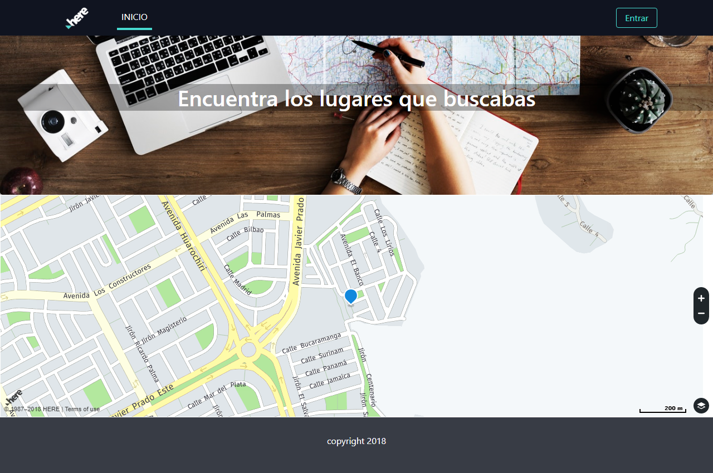
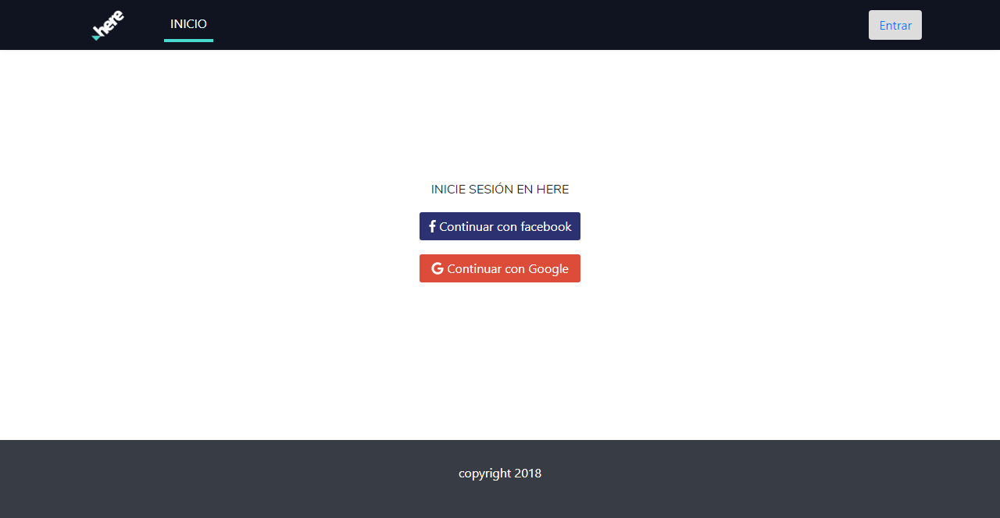
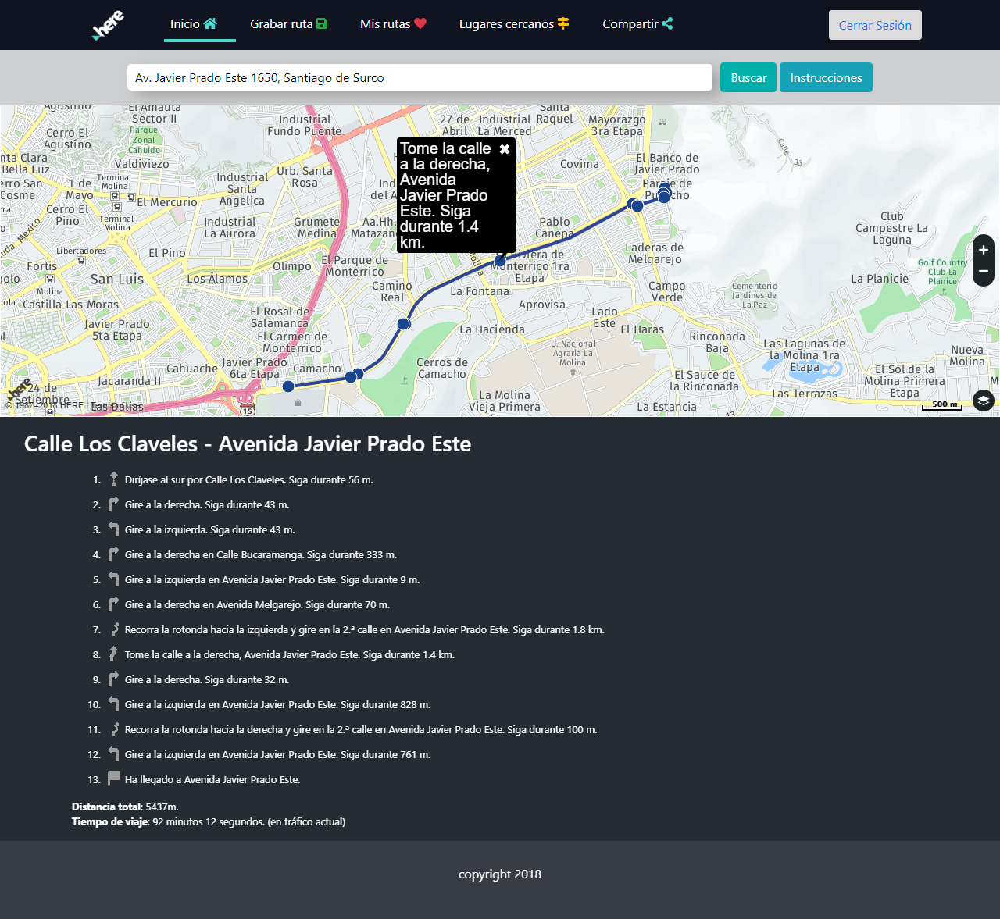
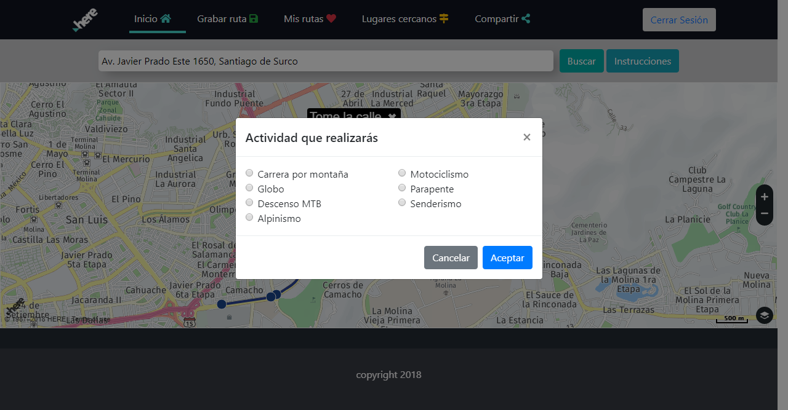
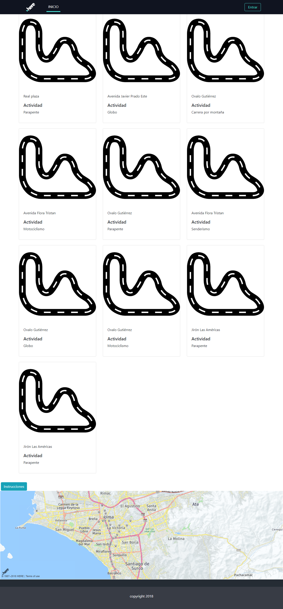
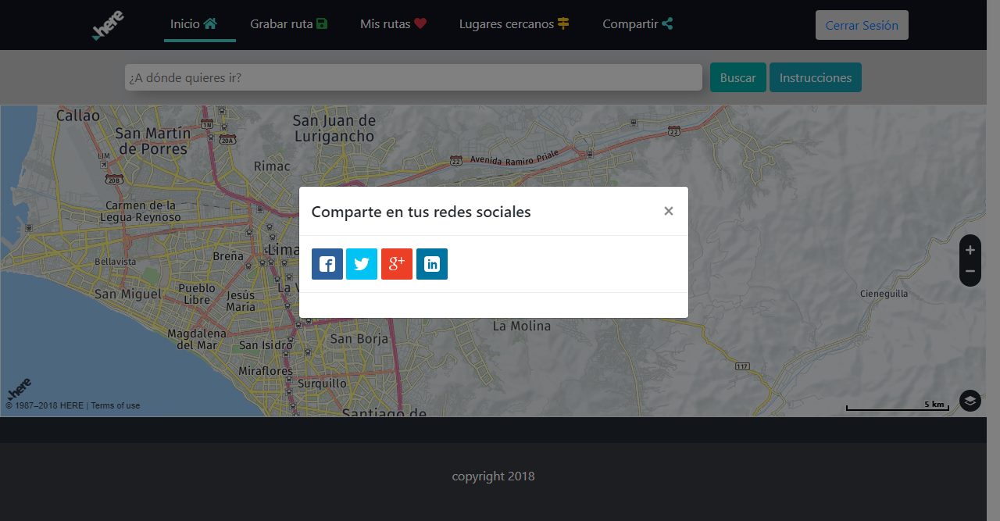
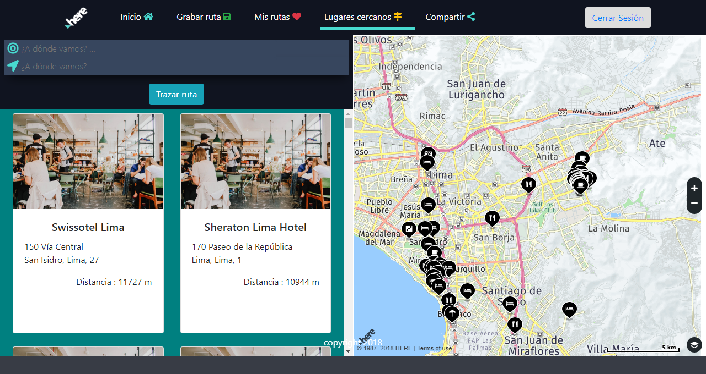

# **Here Maps**

## Introducción :

Esta aplicación fué desarrollada para poder facilitar al usuario una guía que le permita desplazarse en el lugar que se encuentre de acuerdo a sus necesidades.
***

## Plan de trabajo

El proyecto consta de 3 etapas que se desarrollaron en 4 días

#### Primera etapa: 

* Elaborar sketch del proyecto.
* Inicializar el repositorio del proyecto.
* Maquetado (siguiendo la [Guía de estilos](https://brandlive.here.com/ "Aquí" ) proporcionada por la empresa ).

#### Segunda etapa:

* Investigar el Api ; explorar las partes que se utilizarán para cumplir con los requerimientos.
* Primera parte de la funcionalidad .

#### Tercera etapa : 

* Segunda parte de la funcionlidad.
* Manejo de bases de datos .
* Elaboración del README.

## Archivos importantes

El proyecto presenta los siguientes archivos para uso del usuario:

* `README.md` con descripción de la aplicación, uso y ejemplo.
* `js`: Carpeta js que contiene la funcionalidad de la aplicación.
* `index.html`: Página principal de la aplicación.

## Especificaciones

* Se utilizó la librería jQuery en su versión 3.2.1 (como parte del framework bootstrap).
* Se utilizó el framework bootstrap en su versión 4.0.
* Se utilizó Firebase para el manejo de la base de datos.

***

## Flujo de la aplicación:

* La aplicacion inicia con una vista principal en donde se puede visualizar un mapa con su ubicación actual.

* Al dar click en el boton "Entrar" se le ofrece al usuario la opcion de poder entrar a la aplicación con sus cuentas de Google o Facebook.

* Una vez logueado , se pueden consultar direcciones y se muestra la ruta en pantalla; además de las instrucciones para llegar al lugar solicitado (una vez presionado el botón INSTRUCCIONES, de la misma forma si hace click en las partes as resaltadas de la ruta marcada en el mapa).

* Si se da click a la opcion **Grabar ruta** ; se muestra un modal en donde el usuario debe escoger el tipo de ruta que está haciendo. 

* Si se da click en la opcion **Mis rutas** se pueden visualizar las rutas guardadas.

* El usuario cuenta con la opcion **Compartir** a travéz de sus redes sociales.

* En la opción lugares cercanos se muestran puntos de interés tales como : Restaurantes , cafés y hoteles.

***

## Autoras

* Jennifer Carmen [Cuenta GitHub](https://github.com/Jennifercarmen "Repositorio")
* Manuela Flores  [Cuenta GitHub ](https://github.com/ManuelaFlores "Repositorio")

